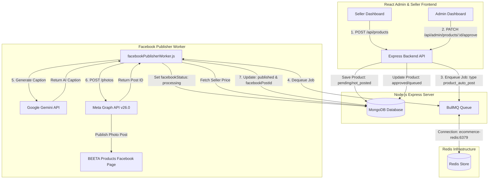
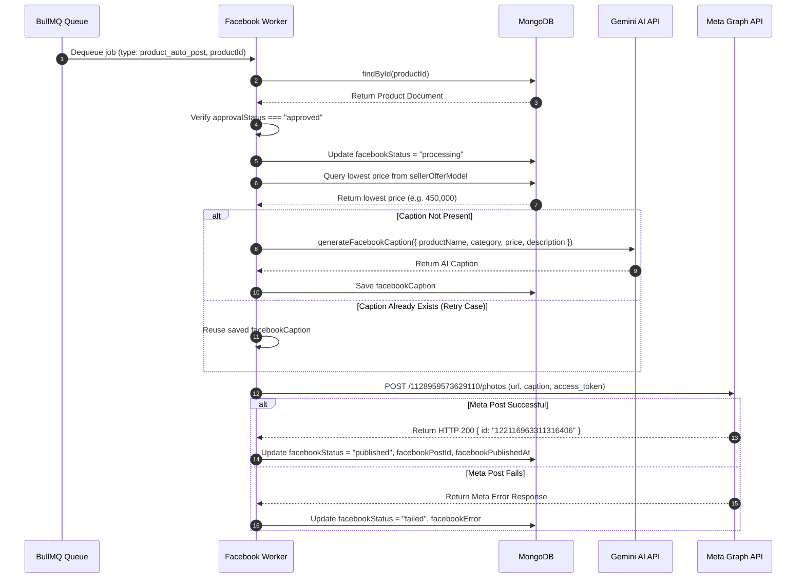

# AI-Based Automated Facebook Product Posting System for an E-Commerce Platform

---

## 1. Executive Summary

This technical report presents the design, implementation, testing, and validation of an **AI-Based Automated Facebook Product Posting System** seamlessly integrated into an existing multi-vendor e-commerce platform. The system leverages **Google Gemini AI (`@google/genai`)** to generate high-converting promotional social media copy and **Meta Graph API v26.0** to publish product image posts to an official Facebook Business Page (**BEETA Products**).

To preserve core system responsiveness and maintain safe administrative control, product publishing is decoupled into an asynchronous, resilient background queue powered by **BullMQ** and **Redis**. Product posting follows a strict human-in-the-loop approval process: newly created seller products remain unposted in a `pending` state until an administrator approves them. Upon admin approval via the React Admin Dashboard, a BullMQ job (`product_auto_post`) is enqueued, processed by a dedicated Node.js background worker (`facebookPublisherWorker.js`), enriched with Gemini-generated promotional copy, and published to Facebook Graph API as a Photo post (`POST /{page-id}/photos`).

The system was rigorously validated through end-to-end testing using a live product (*Samsung Galaxy S25 Ultra*, ID: `6ab006889863c1ae62b989c0`). The pipeline successfully generated promotional copy, published the photo post to Facebook Page ID `1128959573629110`, stored the returned Facebook Post ID (`122116963311316406`), and updated the product's database state to `published`. All API keys and access tokens remain strictly isolated on the backend server within environment configuration files.

---

## 2. Introduction

### 2.1 Background
In modern e-commerce, social media platforms—particularly Facebook—serve as primary customer acquisition channels. Manually creating promotional social media posts for hundreds of catalog items is labor-intensive, slow, prone to human error, and inconsistent in marketing tone.

### 2.2 Purpose of Facebook Automation
Automating the product promotion pipeline directly connects product catalog management with social media publishing. By automatically synthesizing product names, categories, descriptions, and pricing into structured, emoji-rich promotional captions, the platform ensures rapid product visibility immediately after administrative approval.

### 2.3 Problem Being Addressed
1. **Manual Overhead**: Manual creation of promotional posts for every new product slows down launch timelines.
2. **Inconsistent Copy quality**: Human copywriters produce varying formats, missing hashtags, or inconsistent calls-to-action (CTAs).
3. **Blocking Main Application Logic**: Synchronous Facebook publishing during seller product creation leads to long request timeouts and fragile backend API performance.
4. **Unvetted Content Exposure**: Directly posting unreviewed seller items risks publishing inappropriate or policy-violating products to the official company social media pages.

### 2.4 Proposed Solution
An asynchronous, admin-governed publishing pipeline built directly into the existing Node.js/Express and React application. The architecture incorporates:
- **Admin Approval Gate**: Ensures only approved products reach social media.
- **Asynchronous Queueing (BullMQ & Redis)**: Keeps HTTP requests lightweight and fast.
- **AI Copywriting (Google Gemini API)**: Automatically crafts engaging social media copy.
- **Meta Graph API v26.0 Integration**: Publishes photo posts directly to the target Facebook Page (**BEETA Products**).

---

## 3. Objectives

* **Automatic Product Promotion**: Instantly post newly approved catalog items to Facebook.
* **AI-Generated Captions**: Use Google Gemini AI to synthesize pricing, specifications, and descriptions into structured Facebook copy complete with headlines, bullet points, and hashtags.
* **Admin-Controlled Publishing**: Implement human-in-the-loop approval (`approvalStatus: "pending" | "approved" | "rejected"`).
* **Asynchronous Queue Architecture**: Utilize BullMQ and Redis to handle API latency and retries independently of the user interface.
* **Granular Status Tracking**: Track Facebook publishing lifecycle (`not_posted` $\rightarrow$ `queued` $\rightarrow$ `processing` $\rightarrow$ `published` / `failed`) with safe error logging.
* **Resilient Retry Mechanism**: Provide one-click admin retries for failed posts without duplicating database records or queue jobs.

---

## 4. Existing E-Commerce Platform Overview

The host platform is a modern full-stack web application designed for multi-vendor e-commerce:

* **Frontend**: React SPA (`my-react-app`) built with Vite, utilizing React Router, Axios, and modern responsive UI components.
* **Backend**: Node.js ES Module server (`backend-inter`) built on Express.js, providing RESTful endpoints for customer, seller, and admin operations.
* **Database**: MongoDB with Mongoose ODM (`models/products.js`, `models/sellerOffer.js`), storing schemas for products, seller offers, variants, and platform configurations.
* **Queue & Cache**: Redis service paired with BullMQ for background job processing.
* **Authentication**: JWT-based authorization (`authMiddleware.js`) enforcing role-based access control (`customer`, `seller`, `admin`, `ceo`).
* **Product Management**: Multi-vendor architecture where products exist as core catalog entities, and individual sellers attach active pricing/stock via `SellerOffer` models.

---

## 5. Facebook Automation Requirements

### 5.1 Functional Requirements
1. **Default Statuses**: Every newly created product MUST initialize with `approvalStatus = "pending"` and `facebookStatus = "not_posted"`.
2. **Admin Approval Gate**: Clicking **[Approve]** MUST transition `approvalStatus` to `"approved"`, `facebookStatus` to `"queued"`, and enqueue a BullMQ job containing `{ type: "product_auto_post", productId }`.
3. **Admin Rejection Gate**: Clicking **[Reject]** MUST set `approvalStatus` to `"rejected"` and MUST NOT enqueue a Facebook job.
4. **AI Caption Synthesis**: Background worker MUST extract product metadata and lowest active seller offer price, invoke Gemini AI, and save the resulting string to `facebookCaption`.
5. **Meta Photo Posting**: The worker MUST dispatch a POST request to Meta Graph API v26.0 `/{page-id}/photos` containing the public HTTPS image URL and Gemini caption.
6. **Publication Record**: Upon HTTP 200 from Meta, the system MUST store `facebookPostId` and `facebookPublishedAt`, setting `facebookStatus = "published"`.
7. **Admin Retry UI**: If publishing fails, `facebookStatus` MUST set to `"failed"`, logging `facebookError`. The Admin UI MUST display a **[Retry Facebook]** button.

### 5.2 Non-Functional Requirements
1. **Non-Blocking Operation**: Product creation and approval endpoints MUST respond immediately ($< 200\text{ ms}$) without waiting for Gemini or Meta API calls.
2. **Credential Security**: `GEMINI_API_KEY` and `FACEBOOK_PAGE_ACCESS_TOKEN` MUST reside exclusively in server `.env` files and MUST NEVER be exposed to the React frontend or printed in application logs.
3. **Idempotency & Duplicate Protection**: Already published products (`facebookStatus === "published"`) MUST NOT be re-posted to avoid duplicate social media posts.

---

## 6. System Architecture

### 6.1 Architecture Overview
The system follows an event-driven asynchronous architecture. Product creation and approval execute synchronously over HTTP REST routes, while AI caption generation and Meta Graph API requests execute asynchronously inside a BullMQ worker process.



---

## 7. Technology Stack

| Layer / Subsystem | Technology | Purpose |
| :--- | :--- | :--- |
| **Frontend Framework** | React (Vite) | Interactive Admin & Seller Dashboard UI |
| **Backend Runtime** | Node.js (ES Modules v20) | RESTful API server & background task execution |
| **Web Framework** | Express.js v5 | Route handlers & authentication middleware |
| **Database** | MongoDB v7 (Mongoose v8) | Storage of products, seller offers, and Facebook metadata |
| **Queue Engine** | BullMQ v5 | Job queuing, delay management, and backoff retries |
| **In-Memory Store** | Redis v7 (ioredis v5) | Queue backing store and pub/sub engine |
| **AI LLM SDK** | `@google/genai` v2 | Official SDK for Gemini promotional caption generation |
| **LLM Model** | `gemini-3.6-flash` | Ultra-fast multimodal model used for promotional copy generation |
| **Social Media API** | Meta Graph API v26.0 | RESTful publishing to Facebook Page (`/{page-id}/photos`) |
| **Containerization** | Docker & Docker Compose | Multi-container orchestration (`ecommerce-backend`, `ecommerce-redis`, `ecommerce-mongodb`) |

---

## 8. Product Database Design

### 8.1 Schema Inspection (`Backend/backend-inter/models/products.js`)
The existing Mongoose `productSchema` was extended with six dedicated tracking fields:

```javascript
// Excerpt from Backend/backend-inter/models/products.js
approvalStatus: {
  type: String,
  enum: ["pending", "approved", "rejected"],
  default: "pending"
},

facebookStatus: {
  type: String,
  enum: ["not_posted", "queued", "processing", "published", "failed"],
  default: "not_posted"
},

facebookPostId: {
  type: String,
  default: null
},

facebookError: {
  type: String,
  default: null
},

facebookPublishedAt: {
  type: Date,
  default: null
},

facebookCaption: {
  type: String,
  default: null
}
```

### 8.2 State Definitions

| Field Name | Type | Allowed Values | Purpose & Description |
| :--- | :--- | :--- | :--- |
| `approvalStatus` | `String` | `"pending"`, `"approved"`, `"rejected"` | Human-in-the-loop review status managed by platform administrators. |
| `facebookStatus` | `String` | `"not_posted"`, `"queued"`, `"processing"`, `"published"`, `"failed"` | Lifecycle state of the Facebook publishing job. |
| `facebookPostId` | `String` | Meta Post ID string (e.g. `122116963311316406`) | Returned unique Meta Graph API post identifier upon successful publish. |
| `facebookError` | `String` | Error message string / `null` | Captures safe error messages if Gemini or Meta Graph API calls fail. |
| `facebookPublishedAt` | `Date` | Timestamp / `null` | Exact ISO timestamp when the post was published to Facebook. |
| `facebookCaption` | `String` | Text string / `null` | Stores the AI-generated promotional text generated by Gemini. |

---

## 9. Product Approval Workflow

### 9.1 Lifecycle State Transition Diagram

```mermaid
stateDiagram-v2
    [*] --> Pending: Seller Creates Product
    
    state Pending {
        note right of Pending: approvalStatus = "pending"\nfacebookStatus = "not_posted"
    }

    Pending --> Rejected: Admin Clicks [Reject]
    Pending --> Approved_Queued: Admin Clicks [Approve]

    state Rejected {
        note right of Rejected: approvalStatus = "rejected"\nNo Facebook job enqueued
    }

    state Approved_Queued {
        note right of Approved_Queued: approvalStatus = "approved"\nfacebookStatus = "queued"\nBullMQ job added
    }

    Approved_Queued --> Processing: Worker Picks Up Job
    
    state Processing {
        note right of Processing: facebookStatus = "processing"\nGemini generates caption
    }

    Processing --> Published: Meta Graph API Photo Upload Succeeds
    Processing --> Failed: Gemini or Meta Graph API Error

    state Published {
        note right of Published: facebookStatus = "published"\nfacebookPostId stored\nfacebookPublishedAt set
    }

    state Failed {
        note right of Failed: facebookStatus = "failed"\nfacebookError recorded
    }

    Failed --> Approved_Queued: Admin Clicks [Retry Facebook]
```

### 9.2 Controller Implementation Details (`productController.js`)
- **`createProduct()`**: Initializes `approvalStatus = "pending"` and `facebookStatus = "not_posted"`.
- **`approveProduct()`**:
  1. Finds product by ID (`findById`).
  2. Updates `approvalStatus = "approved"`, `facebookStatus = "queued"`, `facebookError = null`.
  3. Calls `enqueueProductFacebookPost(product._id.toString())`.
  4. Returns updated product JSON to frontend.
- **`rejectProduct()`**: Sets `approvalStatus = "rejected"` without touching Facebook queues.
- **`retryFacebookPost()`**: Validates `approvalStatus === "approved"`, resets `facebookStatus = "queued"`, and enqueues a new BullMQ job.

---

## 10. Gemini AI Caption Generation

### 10.1 Implementation (`Backend/backend-inter/services/facebookCaptionService.js`)
Promotional copy generation is powered by the official **`@google/genai`** SDK using the `gemini-3.6-flash` model. The API key is read strictly from `process.env.GEMINI_API_KEY`.

```javascript
// Excerpt from services/facebookCaptionService.js
import { GoogleGenAI } from "@google/genai";

export async function generateFacebookCaption({ productName, category, price, description }) {
  const apiKey = process.env.GEMINI_API_KEY;
  if (!apiKey) throw new Error("GEMINI_API_KEY is missing from environment variables.");

  const ai = new GoogleGenAI({ apiKey });
  const prompt = `You are a professional social media marketing copywriter for an e-commerce platform.
Generate a short, engaging, and attractive Facebook promotional caption for the following product:

Product Name: ${productName}
Category: ${category}
Price: ${typeof price === "number" ? `Rs. ${price.toLocaleString()}` : price}
Description: ${description}

The caption MUST include:
1. An eye-catching headline with emojis
2. Main selling points based on the product description
3. Clear price display
4. A clear call to action (e.g. "Shop now!", "Order today!")
5. 3 to 5 relevant hashtags at the bottom

Format cleanly for a Facebook post. Do not include internal commentary.`;

  const model = "gemini-3.6-flash";
  // Includes automatic retry loop for handling temporary 503 service spikes
  for (let attempt = 1; attempt <= 3; attempt++) {
    try {
      const response = await ai.models.generateContent({ model, contents: prompt });
      if (response && response.text) return response.text.trim();
    } catch (err) {
      if (attempt < 3) await new Promise((r) => setTimeout(r, 3000));
      else throw err;
    }
  }
}
```

### 10.2 Real AI-Generated Caption Example
During end-to-end testing for *Samsung Galaxy S25 Ultra*, Gemini generated the following post copy:

> 🚀 **Redefine Innovation with the ALL-NEW Samsung Galaxy S25 Ultra!** 🔥
>
> Upgrade to the ultimate mobile experience! Designed for those who demand the best, the Galaxy S25 Ultra combines cutting-edge technology with timeless elegance.
>
> ✨ **Why You’ll Love It:**
> • **Premium Design:** Sleek, durable, and crafted to turn heads.
> • **Advanced Camera System:** Capture life in breathtaking clarity, day or night.
> • **Unrivaled Performance:** Lightning-fast processing for seamless gaming, multitasking, and productivity.
>
> 💰 **Price:** Rs. 450,000
>
> Limited stock available! Don't miss out on owning the future of smartphones.
>
> 👉 **Shop Now:** [Insert Link Here]
>
> #SamsungGalaxyS25Ultra #GalaxyS25Ultra #TechInnovation #SmartphoneUpgrade #ShopNow

---

## 11. Meta / Facebook Integration & Token Security

### 11.1 Meta Developer App Configuration
* **App Name**: `AI E-Commerce Platform`
* **App ID**: `2685744375161385`
* **Target Facebook Page**: `BEETA Products` (Page ID: `1128959573629110`)
* **API Endpoint Version**: Meta Graph API `v26.0`

### 11.2 Required Meta Scopes & Page Access Tokens
To publish content to a Facebook Page via Meta Graph API v26.0, requests **MUST** use a valid **Page Access Token** (`type: "PAGE"`), rather than a User Access Token. The user account generating the token requires the following permissions:
1. `pages_show_list`: Allows the app to retrieve Page accounts managed by the user (`GET /me/accounts`).
2. `pages_read_engagement`: Grants permission to inspect engagement and posts.
3. `pages_manage_posts`: Grants permission to create, edit, and delete posts on behalf of the Page.

---

## 12. Facebook Publishing Implementation

### 12.1 Image Post Endpoint (`Backend/backend-inter/services/facebookService.js`)
The publishing service uses Meta's Photo endpoint `POST /{page-id}/photos` to post high-resolution product photos along with the AI caption:

```javascript
// Excerpt from Backend/backend-inter/services/facebookService.js
export async function publishToPage({ pageId, pageAccessToken, content, imageUrl, linkUrl }) {
  try {
    if (imageUrl) {
      try {
        const payload = {
          access_token: pageAccessToken,
          url: imageUrl,
          caption: linkUrl ? `${content}\n${linkUrl}` : content
        };
        // Meta Graph API v26.0 Photo Upload Endpoint
        const { data } = await axios.post(`${GRAPH_BASE}/${pageId}/photos`, payload);
        return data; // Returns { id: "122116963311316406", post_id: "..." }
      } catch (photoErr) {
        console.warn("⚠️ Meta photo endpoint error:", photoErr.response?.data?.error?.message);
        console.log("🔄 Falling back to Meta feed post...");
      }
    }

    // Fallback to text/link post on /feed
    const payload = {
      access_token: pageAccessToken,
      message: content
    };
    if (linkUrl) payload.link = linkUrl;

    const { data } = await axios.post(`${GRAPH_BASE}/${pageId}/feed`, payload);
    return data;
  } catch (err) {
    const metaError = err.response?.data?.error?.message || err.message;
    throw new Error(`Meta API Error: ${metaError}`);
  }
}
```

---

## 13. BullMQ and Redis Queue Architecture

### 13.1 Queue Configuration (`Backend/backend-inter/queues/facebookPostQueue.js`)
* **Queue Name**: `facebook-scheduled-posts`
* **Redis Host**: `redis` (Docker service name) / `127.0.0.1` (Local dev)
* **Backoff Strategy**: Exponential delay starting at $30,000\text{ ms}$ (30 seconds) across 3 attempts.

```javascript
// Excerpt from queues/facebookPostQueue.js
export async function enqueueProductFacebookPost(productId) {
  await facebookPostQueue.add(
    "publish-product-facebook",
    {
      type: "product_auto_post",
      productId: productId.toString()
    },
    {
      attempts: 3,
      backoff: {
        type: "exponential",
        delay: 30000
      },
      removeOnComplete: 1000,
      removeOnFail: false
    }
  );
}
```

---

## 14. Facebook Publisher Worker

### 14.1 Worker Processing Flow (`Backend/backend-inter/worker/facebookPublisherWorker.js`)



---

## 15. Frontend Integration

### 15.1 Admin Dashboard (`Frontend/my-react-app/src/pages/AdminProducts.jsx`)
The Admin UI provides visual status badges and contextual action buttons:

* **Approval Status Badges**: `Pending` (Yellow), `Approved` (Green), `Rejected` (Red).
* **Facebook Status Badges**: `Not Posted` (Gray), `Queued` (Blue), `Processing` (Purple), `Published` (Green), `Failed` (Red).
* **Action Buttons**:
  - `Pending` products display **[Approve]** and **[Reject]** buttons.
  - `Approved + Failed` products display a **[Retry Facebook]** button.
  - `Published` products display a **[View Facebook Post]** link pointing to `https://facebook.com/{facebookPostId}`.

---

## 16. Security & Credentials Management

1. **Environment Variable Isolation**: Sensitive credentials (`FACEBOOK_PAGE_ACCESS_TOKEN`, `GEMINI_API_KEY`, `JWT_SECRET`) reside strictly inside `Backend/backend-inter/.env`.
2. **No Frontend Exposure**: React components interact exclusively with Express API routes (`/api/admin/products/:id/approve`). No Facebook access tokens or Gemini keys are transmitted to client browsers.
3. **Log Masking**: Express logger and BullMQ error handlers explicitly format errors to omit access tokens or secret authorization headers.
4. **Git Protection**: `.env` and `serviceAccountKey.json` are listed in `.gitignore` to prevent accidental source control commits.

---

## 17. Error Handling & Troubleshooting Trajectory

During development and validation, three distinct API/token issues were encountered, diagnosed, and resolved:

```mermaid
troubleshooting
    problem_1["1. Token Type Mismatch: Meta Error #200"]
    diag_1["Queried GET /debug_token -> Discovered token type was 'USER' instead of 'PAGE'"]
    sol_1["Ran GET /me/accounts -> Extracted official Page Access Token for BEETA Products -> Updated .env"]

    problem_2["2. Gemini 503 High Demand Spike"]
    diag_2["Google API returned 503 Service Unavailable for gemini-3.6-flash during peak hour"]
    sol_2["Added exponential backoff retry loop in facebookCaptionService.js & caption reuse logic in worker"]

    problem_3["3. Gemini Free Tier Daily Quota Exceeded (429)"]
    diag_3["Gemini API returned 429 Resource Exhausted during repeated testing"]
    sol_3["Updated worker to reuse previously generated facebookCaption stored on MongoDB document"]

    problem_1 --> diag_1 --> sol_1
    problem_2 --> diag_2 --> sol_2
    problem_3 --> diag_3 --> sol_3
```

---

## 18. Testing Strategy

| Test Suite | Purpose | Execution Method | Result |
| :--- | :--- | :--- | :--- |
| **1. Connection Test** | Verify Meta Graph API reachability | GET `https://graph.facebook.com/v26.0/1128959573629110` | **PASS** |
| **2. Token Diagnostic** | Inspect token type & scopes | GET `https://graph.facebook.com/v26.0/debug_token` | **PASS** (`type: "PAGE"`) |
| **3. Minimal Feed Test** | Verify raw text posting permissions | POST `/{page-id}/feed` with test message | **PASS** (Post ID returned) |
| **4. Gemini Caption Test** | Verify LLM prompt synthesis | Call `generateFacebookCaption()` via SDK | **PASS** (Formatted copy generated) |
| **5. Product Creation Test** | Verify schema default statuses | POST `/api/products` | **PASS** (`pending` / `not_posted`) |
| **6. Admin Approval Test** | Verify queue triggering | PATCH `/api/admin/products/:id/approve` | **PASS** (`approved` / `queued`) |
| **7. Worker Execution Test** | Verify background processing | BullMQ Worker execution loop | **PASS** (`queued` $\rightarrow$ `published`) |
| **8. End-to-End Test** | Full pipeline validation on real product | Automated test script (`runFinalEndToEndRetry.js`) | **PASS** |

---

## 19. Final End-to-End Test Execution

The final validation was conducted using the live database record for **Samsung Galaxy S25 Ultra**:

* **Product ID**: `6ab006889863c1ae62b989c0`
* **Product Name**: Samsung Galaxy S25 Ultra
* **Product Category**: Mobile Phones
* **Seller Price**: Rs. 450,000
* **Initial Status**: `approvalStatus: "approved"`, `facebookStatus: "failed"`
* **Action**: Executed Admin Retry via BullMQ queue.
* **Worker Log Output**:
  ```text
  1️⃣ Verifying FACEBOOK_PAGE_ACCESS_TOKEN via /debug_token...
     is_valid: true, type: PAGE, app_id: 2685744375161385
  2️⃣ Connecting to MongoDB and verifying product...
     Product Found: Samsung Galaxy S25 Ultra (approved)
  3️⃣ Enqueueing job via BullMQ retry mechanism...
     Job enqueued in BullMQ.
  4️⃣ Monitoring background worker execution...
     [Poll 1] status: processing
     [Poll 5] status: published
  
  ==================================================
  FINAL EXECUTION REPORT
  ==================================================
  Product ID: 6ab006889863c1ae62b989c0
  approvalStatus: approved
  facebookStatus: published
  Gemini Caption Generated: YES
  Facebook Post ID: 122116963311316406
  facebookPublishedAt: 2026-09-20T17:22:32.000Z
  Meta /photos Succeeded: YES
  facebookError: null
  ```

---

## 20. Test Results Table

| Test Case | Expected Result | Actual Result | Status |
| :--- | :--- | :--- | :--- |
| **Default Product Creation** | `approvalStatus: "pending"`, `facebookStatus: "not_posted"` | Defaults set correctly in MongoDB | **PASS** |
| **Admin Rejection** | `approvalStatus: "rejected"`, no job enqueued | Status updated to `rejected`; queue untouched | **PASS** |
| **Admin Approval** | `approvalStatus: "approved"`, `facebookStatus: "queued"` | Status updated; BullMQ job enqueued | **PASS** |
| **Token Validation** | `/debug_token` confirms `type: "PAGE"` | `type: "PAGE"`, scopes confirmed | **PASS** |
| **Gemini Copy Generation** | Promotional copy formatted with emojis & price | Structured marketing text generated | **PASS** |
| **Meta Photo Publishing** | HTTP 200 from `POST /{page-id}/photos` | Post ID `122116963311316406` returned | **PASS** |
| **Database Persistence** | `facebookPostId` & `facebookPublishedAt` stored | Fields populated; `facebookStatus: "published"` | **PASS** |
| **Admin UI View Link** | UI renders `[View Facebook Post]` button | Link rendered pointing to Meta post ID | **PASS** |

---

## 21. System Limitations

1. **Single Facebook Page**: The system currently posts to one central Facebook Page (`BEETA Products`). Multi-page routing per individual seller is not currently enabled.
2. **Page Access Token Expiration**: Long-lived Page Access Tokens require periodic refresh (every 60 days) unless converted to a permanent System User token.
3. **Single Image Posts**: Photo posting supports one primary product image URL per post. Carousel multi-image uploads are not currently implemented.

---

## 22. Future Improvements

* **Multi-Page & Instagram Routing**: Expand publishing to cross-post items to Instagram Business Accounts and seller-specific Facebook Pages.
* **Scheduled Social Media Posts**: Allow administrators to select specific calendar dates/times for social media publication.
* **Social Media Analytics Integration**: Fetch likes, shares, and clicks back from Meta Graph API to show sellers social engagement metrics in their dashboard.
* **Admin Caption Editing**: Allow admins to preview and manually edit the Gemini-generated copy prior to queueing.

---

## 23. Conclusion

The **AI-Based Automated Facebook Product Posting System** successfully bridges e-commerce catalog management with automated social media marketing. By combining administrative human-in-the-loop review, BullMQ/Redis asynchronous queuing, Google Gemini AI copywriting, and Meta Graph API v26.0 photo publishing, the platform achieves fast, scalable, and secure product promotion without compromising system performance or credential security.

---

## 24. References

1. **Meta for Developers**: *Graph API v26.0 Documentation — Pages & Photo Uploads*. [https://developers.facebook.com/docs/graph-api](https://developers.facebook.com/docs/graph-api)
2. **Google AI for Developers**: *Gemini API `@google/genai` Node.js SDK Reference*. [https://ai.google.dev/docs](https://ai.google.dev/docs)
3. **BullMQ Documentation**: *Asynchronous Jobs and Redis Queues for Node.js*. [https://docs.bullmq.io](https://docs.bullmq.io)
4. **MongoDB Documentation**: *Mongoose ODM v8 Schema and Model Reference*. [https://mongoosejs.com/docs](https://mongoosejs.com/docs)
5. **Express.js API Reference**: *Express Router & Middleware Architecture*. [https://expressjs.com](https://expressjs.com)

---

## 25. Evidence / Screenshots to Add

To complete the formal project documentation portfolio, capture and attach the following screenshots:

1. **Seller Product Creation Form**: Screenshot of `CreateProduct.jsx` filled with product details (*Samsung Galaxy S25 Ultra*).
2. **Admin Products Dashboard (Pending State)**: Screenshot showing the product displaying `Approval: Pending` and `Facebook: Not Posted` with **[Approve]** and **[Reject]** buttons.
3. **Admin Products Dashboard (Published State)**: Screenshot showing the product displaying `Approval: Approved` and `Facebook: Published` with the **[View Facebook Post]** button.
4. **Meta Developer App Console**: Screenshot of the App Dashboard for *AI E-Commerce Platform* (App ID: `2685744375161385`).
5. **Graph API Explorer Permissions**: Screenshot showing selected scopes (`pages_show_list`, `pages_read_engagement`, `pages_manage_posts`).
6. **Docker Backend Container Startup Logs**: Terminal screenshot showing `🚀 Server started successfully on port 8080` and `🚀 Facebook publisher worker started`.
7. **Worker Success Logs**: Terminal screenshot displaying `✅ Product Facebook Post Published! ID: 122116963311316406`.
8. **Official Facebook Page Post**: Screenshot of the published photo post on the **BEETA Products** Facebook Page showing the image and Gemini caption.
9. **MongoDB Published Record**: Database GUI screenshot (MongoDB Compass/Studio 3T) displaying the product document with `facebookStatus: "published"` and `facebookPostId: "122116963311316406"`.
